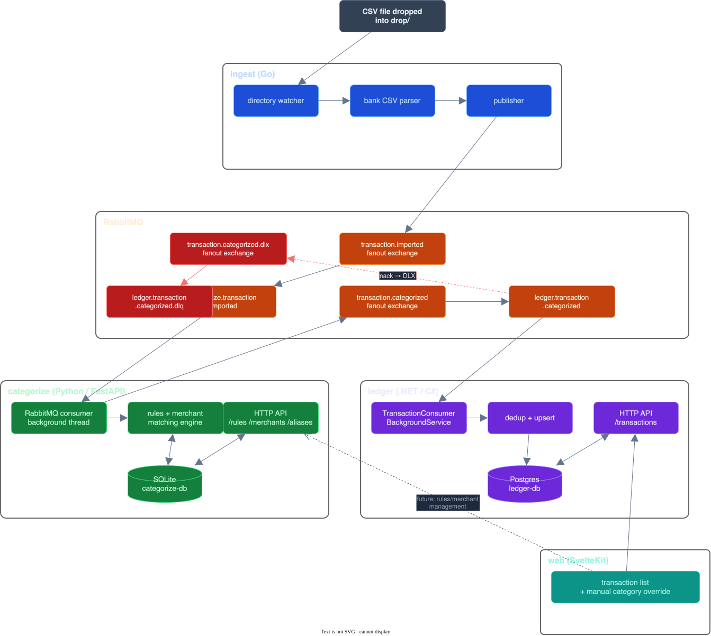
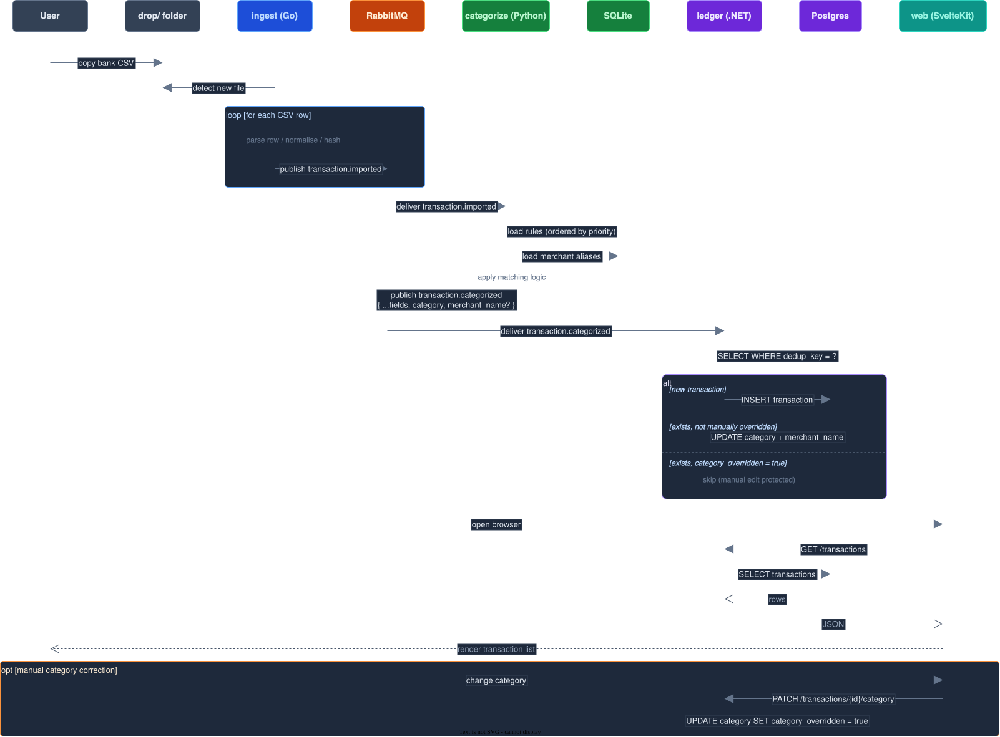
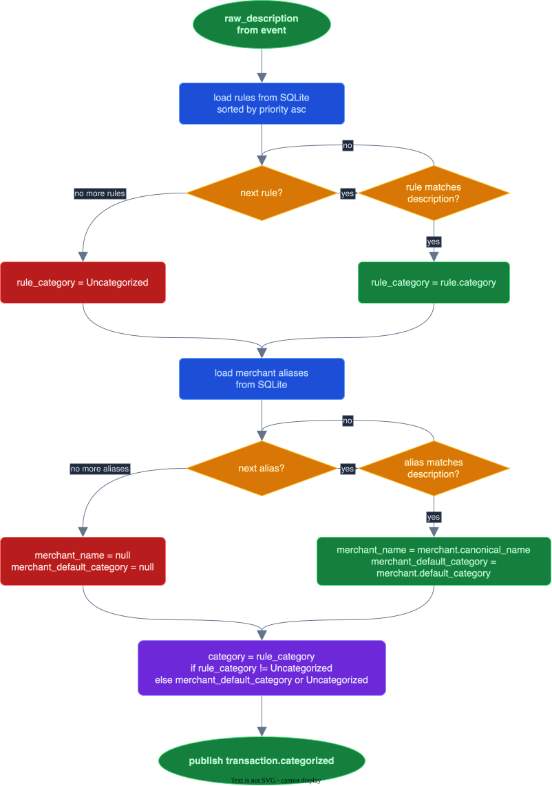
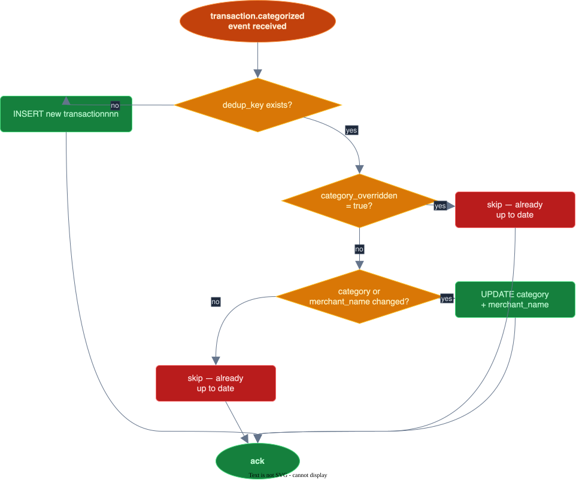

# WYB — Technical Architecture

## System overview



## Transaction import sequence



## Categorisation matching logic



### Match types

| Type | Behaviour |
|---|---|
| `Contains` | `pattern.upper() in description.upper()` |
| `Exact` | `description.upper() == pattern.upper()` |
| `StartsWith` | `description.upper().startswith(pattern.upper())` |
| `Regex` | `re.search(pattern, description, IGNORECASE)` |

## Deduplication key

The same CSV can be imported any number of times safely. The dedup key is a SHA-256 hash of five fields:

```
sha256( account_id | date | amount_minor | currency | normalised_description )
```

`normalised_description` is upper-cased and whitespace-collapsed before hashing, so minor formatting differences in bank exports do not create duplicate transactions.

On conflict ledger applies an upsert:



This makes replay safe: dropping a CSV again re-runs categorisation with the current rules, and the upsert updates any transaction whose category has changed — unless the user manually overrode it.
